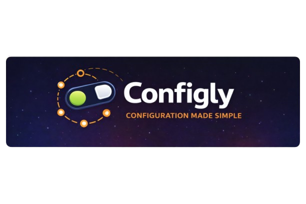
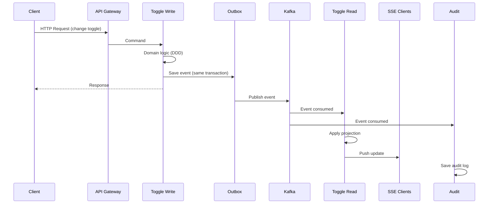
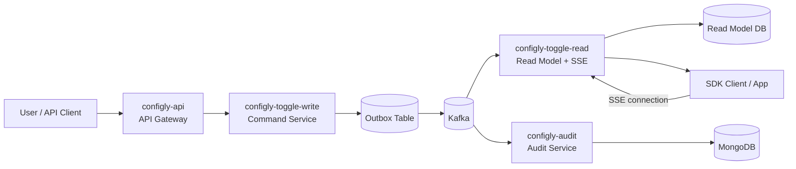
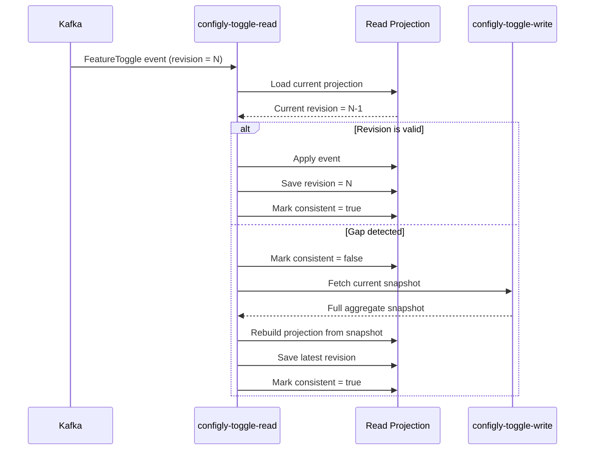

<p align="center">
  
</p>
<h3 align="center">
  Distributed Feature Toggle & Configuration Platform
</h3>
<p align="center">
  Event-driven • Kafka • CQRS • DDD
</p>

## 🚀 What is Configly?

**Configly** is a distributed Feature Toggle & Configuration Platform designed for microservice architectures.

It allows applications to dynamically:

* enable/disable features
* change runtime configuration
* react to changes in near real-time

👉 **No redeploys required.**

---

## 🧠 Key Concepts

* **Feature Toggles** – runtime feature control
* **Projects & Environments** – configuration scoping
* **Event-driven updates** – all changes propagated via Kafka
* **Eventually consistent read model**
* **Real-time updates via SSE**

---

## 🏗️ Architecture

Configly is built using:

* **Domain-Driven Design (DDD)**
* **CQRS**
* **Event-Driven Architecture (Kafka)**
* **Outbox Pattern**
* **Idempotent Consumers**
* **Eventually Consistent Read Models**

---

## 🧩 Services

| Service                    | Responsibility                      |
| -------------------------- | ----------------------------------- |
| **configly-toggle-write**  | Source of truth for feature toggles |
| **configly-toggle-read**   | Read model + SDK API + SSE          |
| **configly-structure**     | Projects & environments             |
| **configly-audit**         | Audit log (MongoDB)                 |
| **configly-api**           | API Gateway                         |

---

## 🔄 High-Level Flow

### 1. Write Flow (Command Side)

1. Client sends request → **API Gateway**
2. Request goes to → **configly-toggle-write**
3. Domain logic is executed (DDD aggregate)
4. Event is stored in **Outbox table**
5. Transaction commits
6. Outbox publisher sends event to **Kafka**

---

## 🔄 System Flow



## 🔄 Gap detection Flow



## 📡 Event Flow (Kafka)

```
configly-toggle-write
        ↓
     Outbox
        ↓
     Kafka Topic
        ↓
configly-toggle-read
        ↓
Projection (Read Model)
```

* Events are partitioned by **domain key (e.g. projectId)**
* Ensures **ordering guarantees per domain**
* Consumers are **idempotent**

---

## 📖 Read Flow (Query Side)

1. Client/SDK calls → **configly-toggle-read**
2. Data is served from **read model (projection)**
3. No direct calls to write service

👉 Fast and scalable reads

---

## ⚡ Real-time Updates (SSE)

Configly provides real-time updates via **Server-Sent Events (SSE)**.

### Flow:

```
SDK Client
    ↓ (connect)
configly-toggle-read (SSE endpoint)
    ↓
Kafka Event arrives
    ↓
Projection updated
    ↓
SSE event pushed to clients
```

### Result:

* Clients receive **instant updates**
* No polling required
* In-memory config stays fresh

---

## 🔁 Handling Eventual Consistency

Since the system is distributed:

* Read model may temporarily lag behind write model
* System ensures consistency via:

### ✔ Revision-based updates

Each entity has a **revision number**

### ✔ Gap detection

If event order is broken:

* read service detects gap
* triggers **rebuild from source of truth**

### ✔ Idempotency

* duplicate events are safely ignored

---

## 🧪 What this project demonstrates

* Designing distributed systems
* Handling eventual consistency
* Kafka partitioning strategy
* Outbox pattern implementation
* Idempotent consumers
* CQRS in practice
* Real-time systems with SSE
* Clean Architecture + DDD

---

## 🛠️ Tech Stack

* Java 21
* Spring Boot
* Kafka
* jOOQ
* PostgreSQL
* MongoDB
* Docker

---

## 🚧 Running the project (WIP)

Docker Compose setup is planned to allow:

```bash
docker-compose up
```

Which will start:

* Kafka
* All Configly services
* Databases

---

## 💡 Why this project?

This project was built to explore:

* real-world distributed architecture
* trade-offs between consistency and scalability
* event-driven system design

---

<p align="center">
  Built for learning, but designed like production 🚀
</p>

